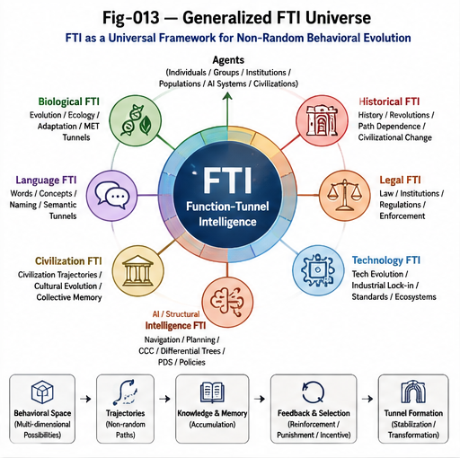
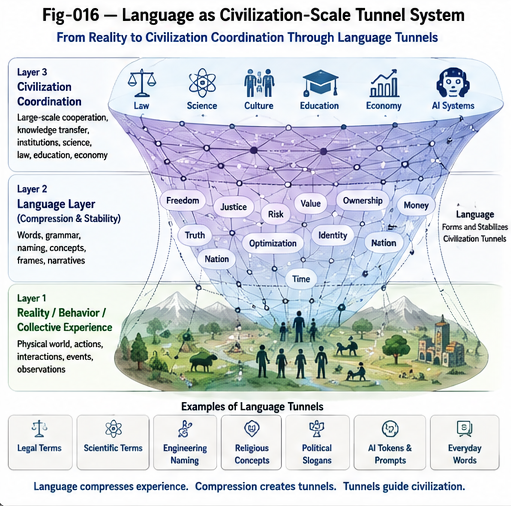
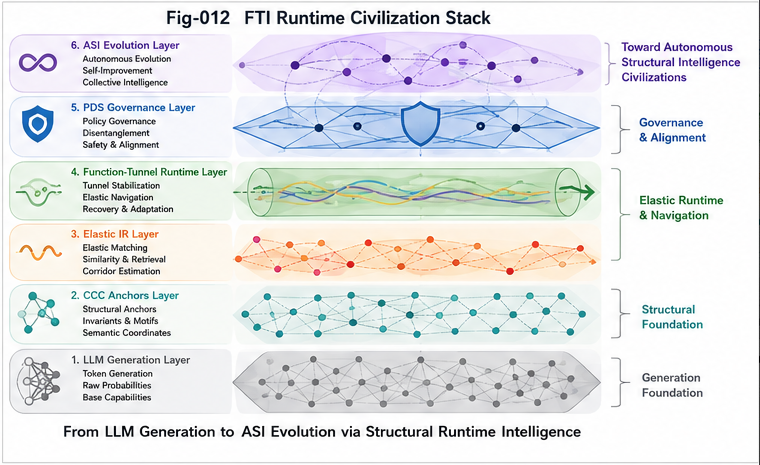
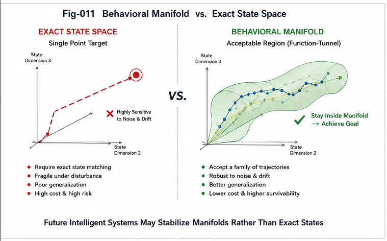
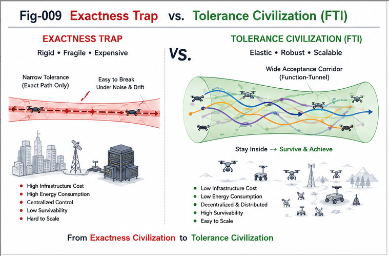
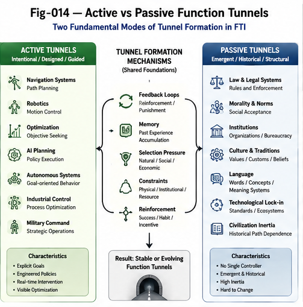
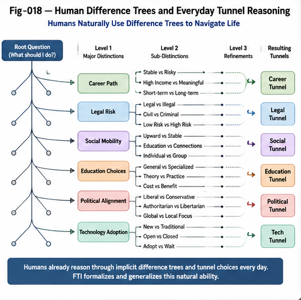

# Function-Tunnel Intelligence (FTI)
## A Structural Intelligence Framework for Navigation, Civilization, Language, Evolution, and Autonomous Systems

Function-Tunnel Intelligence (FTI) studies how agents move through behavioral spaces under constraints, feedback, memory, reinforcement, and historical accumulation.

FTI began as a framework for:

- trajectory analysis,
- navigation,
- behavioral routing,
- and tunnel-guided optimization.

However, the framework naturally generalizes far beyond engineered navigation systems.

FTI also applies to:

- biological evolution,
- civilization development,
- legal and moral systems,
- technological lock-in,
- language-mediated coordination,
- scientific convergence,
- collective intelligence,
- and future autonomous AI systems.

Under generalized FTI:

> Intelligence emerges through the formation, stabilization, inheritance, and navigation of reusable tunnels inside partially random spaces.

## Why FTI Matters

Traditional theories often interpret large-scale systems through either:

- randomness,
- or centralized intelligent design.

FTI proposes a structural middle layer.

Many systems evolve through:

- tunnel formation,
- reinforcement,
- coordination pressure,
- memory accumulation,
- historical inertia,
- and behavioral reuse.

This applies to:

|Domain	|Example Tunnel Systems |
|---|---|
|Biology	|Evolutionary adaptation
|Society	|Law, morality, institutions
|Civilization	|Historical trajectories
|Technology	|Industrial lock-in
|Language	|Conceptual compression
|AI Systems	|Optimization and coordination corridors
|Science	|Research convergence

## Core FTI Perspective

Under generalized FTI:

- evolution is not fully random,
- civilization is not fully chaotic,
- intelligence is not merely optimization,
- and autonomous AI may also develop tunnel structures.

FTI proposes that:

> Large-scale intelligence systems evolve through partially constrained tunnel geometries.

## Language as Tunnel Infrastructure

Language is one of the largest civilization-scale tunnel systems.

Language shapes:

- perception,
- coordination,
- memory,
- legal structures,
- scientific knowledge,
- engineering systems,
- and collective behavior.

Under FTI:

> Language does not merely describe tunnels.\
> Language itself forms tunnels.

## Recursive FTI

One of the most surprising implications of generalized FTI is recursive self-reference.

FTI eventually begins explaining:

- scientific convergence,
- theory formation,
- engineering trajectories,
- and even the emergence of FTI itself.

This leads to a recursive observation:

> Intelligence systems form tunnels,\
> and eventually develop theories explaining the tunnels that formed them.

## Intelligence as Tunnel Formation

FTI proposes a broader interpretation of intelligence:

> Intelligence is not the elimination of randomness.\
> Intelligence is the formation, recognition, stabilization, and navigation of useful tunnels inside partially random spaces.

This perspective connects:

- Structural Intelligence,
- CCC,
- Differential Trees,
- PDS,
- trajectory systems,
- policy systems,
- and autonomous AI coordination.

## The Importance of Structural Observation

FTI did not emerge purely from abstract philosophical speculation.

Instead, it gradually emerged through long-term engineering interaction with:

- trajectory systems,
- metric structures,
- software coordination,
- naming systems,
- policy systems,
- recursive constraints,
- and behavioral stabilization problems.

This observation is important.
``
Because it suggests:

> The path toward deeper intelligence theories may not require mythical genius alone.\
> It may emerge through sustained structural observation and recursive refinement.

In this sense:

The road toward structural intelligence may already exist beneath ordinary engineering practice.

## Repository Structure

    docs/
    ├── START-HERE.md
    ├── FTI-General-Definition-And-Social-Scope.md
    ├── Recursive-FTI-And-The-Geometry-Of-Intelligence.md
    ├── FIGURE-INDEX.md
    ├── VISUAL-LANGUAGE.md
    └── figures/

## Figure System

### Phase I — Engineering FTI

(Fig-001 ~ Fig-012)

Focus:

- trajectory systems,
- navigation,
- optimization,
- tunnel guidance,
- runtime mechanics.

---

---

---

---

### Phase II — Generalized Civilization-Scale FTI

(Fig-013 ~ Fig-018)

Focus:

- civilization tunnels,
- language tunnels,
- passive tunnels,
- path dependence,
- recursive FTI,
- tunnel formation across intelligence systems.

---

---

---

## Relationship to DBM-SI

FTI naturally connects to:

- CCC,
- Differential Trees,
- PDS,
- Structural Intelligence,
- trajectory intelligence,
- policy systems,
- UTN,
- and Autonomous Structural Intelligence (ASI).

Within DBM-SI:

- tunnels become structural attractors,
- trajectories become observable behavioral flows,
- and intelligence becomes tunnel-aware structural adaptation.

## Final Perspective

Navigation is only the visible engineering surface of FTI.

The deeper subject of FTI is:

- tunnel formation,
- tunnel stabilization,
- tunnel inheritance,
- tunnel competition,
- and tunnel-guided evolution across intelligence systems.

Under this broader perspective:

> Civilization itself may be interpreted as a large-scale evolving network of interacting function tunnels.

---

## Citation

    @software{tan_fti_2026,
      author = {Tan, Sizhe},
      title = {Function-Tunnel Intelligence (FTI): Elastic Structural Runtime Intelligence for Robust Autonomous Systems},
      year = {2026},
      version = {1.0.0},
      url = {https://github.com/sizhet/Function-Tunnel-Intelligence-FTI},
      doi = {TBD}
    }

## License

This repository is released under the Apache-2.0 License

---

## 📚 DBM-SI Series Navigation

See:\
[./docs/DBM-SI-Series-of-gitHub-Repositories/DBM-SI-Common-Abbreviations-and-Terminology.md](./docs/DBM-SI-Series-of-gitHub-Repositories/DBM-SI-Common-Abbreviations-and-Terminology.md)

[./docs/DBM-SI-Series-of-gitHub-Repositories/DBM-SI-Series-of-gitHub-Repositories.md](./docs/DBM-SI-Series-of-gitHub-Repositories/DBM-SI-Series-of-gitHub-Repositories.md)

