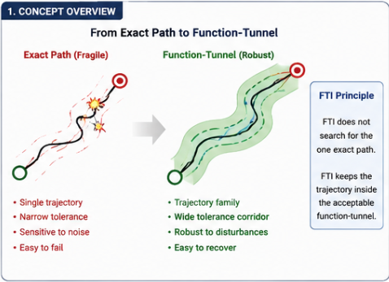
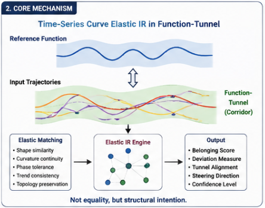
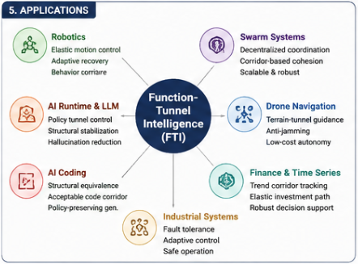
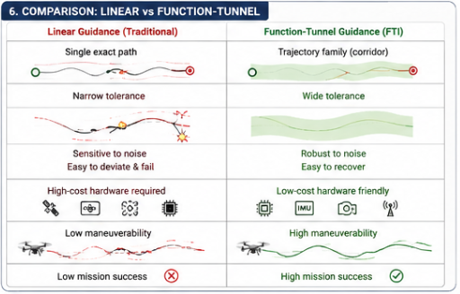
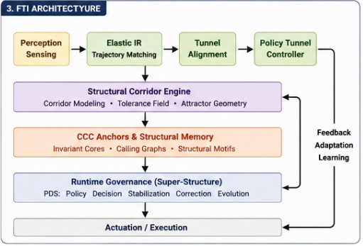
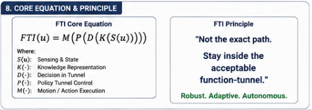

# Function-Tunnel Intelligence (FTI)
## Elastic Structural Runtime Intelligence for Robust Autonomous Systems

> **From Exact Matching to Elastic Structural Intelligence**

## Overview

Function-Tunnel Intelligence (FTI) proposes a new runtime intelligence paradigm for autonomous systems operating in noisy, uncertain, low-cost, and dynamically changing environments.

Traditional intelligent systems typically assume:

- exact paths,
- exact synchronization,
- exact terrain matching,
- exact state transitions,
- and exact control loops.

However, real-world systems rarely operate under such ideal conditions.

Low-cost drones, swarm robotics, autonomous agents, industrial systems, AI runtimes, and biological organisms all exhibit:

- sensor noise,
- imperfect control,
- delayed feedback,
- environmental perturbation,
- and structural uncertainty.

FTI introduces a fundamentally different approach:

### Intelligence should not optimize for a single exact trajectory.
### Intelligence should remain inside an acceptable structural function-tunnel.

Instead of rigid linear guidance, FTI performs:

- elastic trajectory matching,
- structural corridor navigation,
- topology-preserving recovery,
- adaptive runtime steering,
- and policy-aware stabilization.

This repository explores:

- Function-Tunnel Navigation,
- Time-Series Curve Elastic IR,
- Elastic Structural Runtime Intelligence,
- Behavioral Manifold Control,
- Tunnel-Based Governance,
- and Structural Corridor Systems.

## Core Idea

Traditional systems:

|Traditional Exact Guidance	|Function-Tunnel Intelligence |
|---|---|
|Single exact path	|Acceptable trajectory family
|Narrow tolerance	|Elastic corridor
|Point matching	|Structural matching
|Exact synchronization	|Adaptive tolerance
|Linear navigation	|Tunnel navigation
|Hard failure	|Structural recovery
|Exact state transition	|Behavioral manifold continuity

FTI shifts autonomous systems from:

### coordinate targeting

to:

### structural homing inside elastic function-tunnels.

## Core Principle

The objective is no longer:

    trajectory=exact_reference

Instead:

    trajectory∈acceptable_function_tunnel

This transition dramatically improves:

- robustness,
- low-cost autonomy,
- swarm scalability,
- runtime tolerance,
- and structural stability.

## Time-Series Curve Elastic IR

FTI is built upon:

### Time-Series Curve Elastic IR

which performs:

- elastic trajectory matching,
- topology-aware alignment,
- shape-preserving retrieval,
- and structural corridor estimation.

Unlike traditional exact matching systems, Elastic IR focuses on:

- curvature continuity,
- phase tolerance,
- trend consistency,
- attractor preservation,
- and behavioral similarity.

Its purpose is not to determine:

    “Are these trajectories identical?”

Instead:

    “Do these trajectories remain inside the same structural function-tunnel?”

## Function-Tunnel Navigation

FTI introduces:

### Function-Tunnel Navigation

A navigation paradigm where autonomous systems operate inside:

- trajectory corridors,
- structural attractor fields,
- elastic terrain tunnels,
- and adaptive behavioral manifolds.

This allows:

- local deviations,
- temporary drift,
- partial mismatches,
- topology-preserving rerouting,
- and robust mission continuation.

## Why FTI Matters

Modern AI and robotics increasingly face a major contradiction:

|Problem	| Consequence |
|---|---|
|Exact-control assumptions	|Fragile systems
|Expensive precision hardware	|Poor scalability
|Narrow tolerance guidance	|Frequent mission failure
|High sensor dependency	|Weak robustness
|Centralized intelligence	|Low adaptability

FTI addresses these limitations through:

### Elastic Structural Runtime Intelligence

where tolerance geometry becomes a first-class runtime primitive.

## Applications

### Low-Cost Drone Navigation

Transition from:

- terrain-matching linear guidance

to:

- terrain-matching function-tunnel guidance.

Benefits:

- wider tolerance corridors,
- lower hardware requirements,
- higher maneuver survivability,
- anti-jamming robustness,
- and swarm scalability.

### Robotics

FTI enables:

- adaptive motion corridors,
- topology-preserving recovery,
- behavioral manifold stabilization,
- and elastic autonomous control.

Robots no longer require exact trajectories.
They only need to remain inside acceptable structural motion tunnels.

### Swarm Systems

FTI supports:

- decentralized structural cohesion,
- corridor-based coordination,
- elastic collective behavior,
- and low-bandwidth swarm intelligence.

.png)

### AI Runtime Governance

FTI enables:

- policy tunnel control,
- runtime stabilization,
- structural rerouting,
- hallucination mitigation,
- and elastic behavioral governance for LLM systems.

##$ AI Coding

FTI shifts AI coding from:

- exact token prediction

to:

- structurally acceptable generation corridors.

This enables:

- policy-preserving generation,
- structural equivalence matching,
- CCC-preserving transformations,
- and elastic software synthesis.

---

### Fig-006: Comparison of Linear vs Function-Tunnel

---

## FTI Runtime Architecture

### Core Layers
### 1. Perception & Sensing

Collect environmental and runtime observations.

### 2. Elastic IR Layer

Perform structural trajectory retrieval and matching.

### 3. Tunnel Alignment Engine

Estimate corridor membership and deviation geometry.

### 4. Policy Tunnel Controller

Perform correction, stabilization, rerouting, and governance.

### 5. Structural Memory / CCC Anchors

Maintain invariant structural homing references.

### 6. Runtime Execution

Execute adaptive actions while preserving tunnel continuity.

## Relationship to ASI / PDS / CCC

--- 

### Fig-007 - FTI Workflow (End-to-End-Loop)

.png)

---

FTI naturally integrates with:

- Autonomous Structural Intelligence (ASI)
- Policy Decision Systems (PDS)
- CCC (Common Concept Core)
- Differential Trees
- Structural Runtime Governance

FTI can be viewed as:

### the elastic runtime geometry layer

inside future structural intelligence systems.

## Canonical Equation

    FTI(u)=M(P(T(E(S(u)))))

Where:

- S(.) = sensing & state acquisition
- E(.) = Elastic IR & tunnel estimation
- T(.) = tunnel alignment & structural evaluation
- P(.) = policy tunnel control
- M(.) = motion / runtime execution

--- 

### Fig-008 - FTI Core Equation andPrinciple

---

## Vision

FTI proposes that future intelligent systems should not rely solely on:

- stronger generation,
- larger models,
- or higher precision hardware.

Instead, future systems must achieve:

### Elastic Structural Stability

through:

- function-tunnels,
- behavioral manifolds,
- structural corridors,
- and runtime adaptive homing.

## Future Directions
- Function-Tunnel Robotics
- Function-Tunnel Swarm Intelligence
- Elastic Runtime Governance
- Tunnel-Based AI Coding
- Structural Corridor IR
- Behavioral Manifold Learning
- Tunnel-Based Differential Trees
- Runtime Stability Geometry
- Autonomous Elastic Systems
- Policy Tunnel Intelligence

## Conclusion

Function-Tunnel Intelligence (FTI) introduces a new paradigm for robust autonomous systems.

Its central principle is simple:

> Intelligence is not the pursuit of a single exact path.\
> Intelligence is the ability to remain inside an acceptable structural function-tunnel.

FTI represents a transition from:

### exact-control intelligence

to:

### elastic structural runtime intelligence.